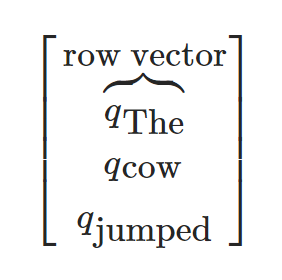

# 序列模型和长短句记忆（LSTM）模型

* 前馈网络

之前我们已经学过了许多的前馈网络。所谓前馈网络, 就是网络中不会保存状态。然而有时这并不是我们想要的效果。在自然语言处理
 (NLP, Natural Language Processing) 中, 序列模型是一个核心的概念。
 
* 序列模型

所谓序列模型, 即输入依赖于时间信息的模型。一个典型的序列模型是隐马尔科夫模型 (HMM, Hidden Markov Model)。另一个序列模型的例
子是条件随机场 (CRF, Conditional Random Field)。

* 循环神经网络

循环神经网络是指可以保存某种状态的神经网络。比如说, 神经网络中上个时刻的输出可以作为下个 时刻的输入的一部分, 以此信息就可以
通过序列在网络中一直往后传递。对于LSTM (Long-Short Term Memory) 来说, 序列中的每个元素都有一个相应的隐状态,
该隐状态原则上可以包含序列当前结点之前的任一节点的信息。我们可以使用隐藏状态来预测语言模型中的单词, 词性标签以及其他。

## 1.Pytorch中的LSTM
在正式学习之前，有几个点要说明一下，Pytorch中 LSTM 的输入形式是一个 3D 的Tensor，每一个维度都有重要的意义，第一个维度就是序列本身，
第二个维度是`mini-batch`中实例的索引，第三个维度是输入元素的索引，我们之前没有接触过`mini-batch`，所以我们就先忽略它并假设第
二维的维度是1。如果要用"The cow jumped"这个句子来运行一个序列模型，那么就应该把它整理成如下的形式：



除了有一个额外的大小为1的第二维度。

此外, 你还可以向网络逐个输入序列, 在这种情况下, 第一个轴的大小也是1。

来看一个简单的例子。

```buildoutcfg
# Author: Robert Guthrie

import torch
import torch.nn as nn
import torch.nn.functional as F
import torch.optim as optim

torch.manual_seed(1)
```
```buildoutcfg
lstm = nn.LSTM(3, 3)  # 输入维度为3维，输出维度为3维
inputs = [torch.randn(1, 3) for _ in range(5)]  # 生成一个长度为5的序列

# 初始化隐藏状态.
hidden = (torch.randn(1, 1, 3),
          torch.randn(1, 1, 3))
for i in inputs:
    # 将序列中的元素逐个输入到LSTM.
    # 经过每步操作,hidden 的值包含了隐藏状态的信息.
    out, hidden = lstm(i.view(1, 1, -1), hidden)

# 另外我们可以对一整个序列进行训练.
# LSTM第一个返回的第一个值是所有时刻的隐藏状态
# 第二个返回值是最后一个时刻的隐藏状态
#(所以"out"的最后一个和"hidden"是一样的)
# 之所以这样设计:
# 通过"out"你能取得任何一个时刻的隐藏状态，而"hidden"的值是用来进行序列的反向传播运算, 具体方式就是将它作为参数传入后面的 LSTM 网络.

# 增加额外的第二个维度.
inputs = torch.cat(inputs).view(len(inputs), 1, -1)
hidden = (torch.randn(1, 1, 3), torch.randn(1, 1, 3))  # 清空隐藏状态. 
out, hidden = lstm(inputs, hidden)
print(out)
print(hidden)
```

* 输出结果：

```buildoutcfg
tensor([[[-0.0187,  0.1713, -0.2944]],

        [[-0.3521,  0.1026, -0.2971]],

        [[-0.3191,  0.0781, -0.1957]],

        [[-0.1634,  0.0941, -0.1637]],

        [[-0.3368,  0.0959, -0.0538]]], grad_fn=<StackBackward>)
(tensor([[[-0.3368,  0.0959, -0.0538]]], grad_fn=<StackBackward>), tensor([[[-0.9825,  0.4715, -0.0633]]], grad_fn=<StackBackward>))
```

## 2.例子:用LSTM来进行词性标注
在这部分, 我们将会使用一个 LSTM 网络来进行词性标注。在这里我们不会用到维特比算法, 前向-后向算法或者任何类似的算法,而是将这部
分内容作为一个 (有挑战) 的练习留给读者, 希望读者在了解了这部分的内容后能够实现如何将维特比算法应用到 LSTM 网络中来。

该模型如下:输入的句子是，其中，标签的集合定义为 T，
为单词的标签，用表示对单词词性的预测。

这是一个结构预测模型, 我们的输出是一个序列, 其中。

在进行预测时, 需将句子每个词输入到一个 LSTM 网络中。将时刻 i​ 的隐藏状态标记为,同样地, 对每个标签赋一个
独一无二的索引 (类似 word embeddings 部分 word_to_ix 的设置). 然后就得到了的预测规则：


即先对隐状态进行一个仿射变换, 然后计算一个对数 softmax, 最后得到的预测标签即为对数 softmax 中最大的值对应的标签. 注意, 这也
意味着 A 空间的维度是|T|​。

#### 2.1 准备数据
```buildoutcfg
def prepare_sequence(seq, to_ix):
    idxs = [to_ix[w] for w in seq]
    return torch.tensor(idxs, dtype=torch.long)

training_data = [
    ("The dog ate the apple".split(), ["DET", "NN", "V", "DET", "NN"]),
    ("Everybody read that book".split(), ["NN", "V", "DET", "NN"])
]
word_to_ix = {}
for sent, tags in training_data:
    for word in sent:
        if word not in word_to_ix:
            word_to_ix[word] = len(word_to_ix)
print(word_to_ix)
tag_to_ix = {"DET": 0, "NN": 1, "V": 2}

# 实际中通常使用更大的维度如32维, 64维.
# 这里我们使用小的维度, 为了方便查看训练过程中权重的变化.
EMBEDDING_DIM = 6
HIDDEN_DIM = 6
```

* 输出结果：

```buildoutcfg
{'The': 0, 'dog': 1, 'ate': 2, 'the': 3, 'apple': 4, 'Everybody': 5, 'read': 6, 'that': 7, 'book': 8}
```

#### 2.1 创建模型
```buildoutcfg
class LSTMTagger(nn.Module):

    def __init__(self, embedding_dim, hidden_dim, vocab_size, tagset_size):
        super(LSTMTagger, self).__init__()
        self.hidden_dim = hidden_dim

        self.word_embeddings = nn.Embedding(vocab_size, embedding_dim)

        # LSTM以word_embeddings作为输入, 输出维度为 hidden_dim 的隐藏状态值
        self.lstm = nn.LSTM(embedding_dim, hidden_dim)

        # 线性层将隐藏状态空间映射到标注空间
        self.hidden2tag = nn.Linear(hidden_dim, tagset_size)
        self.hidden = self.init_hidden()

    def init_hidden(self):
        # 一开始并没有隐藏状态所以我们要先初始化一个
        # 关于维度为什么这么设计请参考Pytoch相关文档
        # 各个维度的含义是 (num_layers, minibatch_size, hidden_dim)
        return (torch.zeros(1, 1, self.hidden_dim),
                torch.zeros(1, 1, self.hidden_dim))

    def forward(self, sentence):
        embeds = self.word_embeddings(sentence)
        lstm_out, self.hidden = self.lstm(
            embeds.view(len(sentence), 1, -1), self.hidden)
        tag_space = self.hidden2tag(lstm_out.view(len(sentence), -1))
        tag_scores = F.log_softmax(tag_space, dim=1)
        return tag_scores
```

#### 2.3 训练模型
```buildoutcfg
model = LSTMTagger(EMBEDDING_DIM, HIDDEN_DIM, len(word_to_ix), len(tag_to_ix))
loss_function = nn.NLLLoss()
optimizer = optim.SGD(model.parameters(), lr=0.1)

# 查看训练前的分数
# 注意: 输出的 i,j 元素的值表示单词 i 的 j 标签的得分
# 这里我们不需要训练不需要求导，所以使用torch.no_grad()
with torch.no_grad():
    inputs = prepare_sequence(training_data[0][0], word_to_ix)
    tag_scores = model(inputs)
    print(tag_scores)

for epoch in range(300):  # 实际情况下你不会训练300个周期, 此例中我们只是随便设了一个值
    for sentence, tags in training_data:
        # 第一步: 请记住Pytorch会累加梯度.
        # 我们需要在训练每个实例前清空梯度
        model.zero_grad()

        # 此外还需要清空 LSTM 的隐状态,
        # 将其从上个实例的历史中分离出来.
        model.hidden = model.init_hidden()

        # 准备网络输入, 将其变为词索引的 Tensor 类型数据
        sentence_in = prepare_sequence(sentence, word_to_ix)
        targets = prepare_sequence(tags, tag_to_ix)

        # 第三步: 前向传播.
        tag_scores = model(sentence_in)

        # 第四步: 计算损失和梯度值, 通过调用 optimizer.step() 来更新梯度
        loss = loss_function(tag_scores, targets)
        loss.backward()
        optimizer.step()

# 查看训练后的得分
with torch.no_grad():
    inputs = prepare_sequence(training_data[0][0], word_to_ix)
    tag_scores = model(inputs)

    # 句子是 "the dog ate the apple", i,j 表示对于单词 i, 标签 j 的得分.
    # 我们采用得分最高的标签作为预测的标签. 从下面的输出我们可以看到, 预测得
    # 到的结果是0 1 2 0 1. 因为 索引是从0开始的, 因此第一个值0表示第一行的
    # 最大值, 第二个值1表示第二行的最大值, 以此类推. 所以最后的结果是 DET
    # NOUN VERB DET NOUN, 整个序列都是正确的!
    print(tag_scores)
```

* 输出结果：

```buildoutcfg
tensor([[-1.1389, -1.2024, -0.9693],
        [-1.1065, -1.2200, -0.9834],
        [-1.1286, -1.2093, -0.9726],
        [-1.1190, -1.1960, -0.9916],
        [-1.0137, -1.2642, -1.0366]])
tensor([[-0.0858, -2.9355, -3.5374],
        [-5.2313, -0.0234, -4.0314],
        [-3.9098, -4.1279, -0.0368],
        [-0.0187, -4.7809, -4.5960],
        [-5.8170, -0.0183, -4.1879]])
```

## 3.练习:使用字符级特征来增强 LSTM 词性标注器
在上面的例子中, 每个词都有一个词嵌入, 作为序列模型的输入. 接下来让我们使用每个的单词的 字符级别的表达来增强词嵌入。我们期望这
个操作对结果能有显著提升, 因为像词缀这样的字符级信息对于词性有很大的影响。比如说, 像包含词缀 -ly 的单词基本上都是被标注为副词。

具体操作如下：用的字符级表达, 同之前一样，我们使用来表示词嵌入。序列模型的输入就
变成了和的拼接。因此, 如果的维度是5， 
的维度是3，那么我们的 LSTM 网络的输入维度大小就是8。

为了得到字符级别的表达, 将单词的每个字符输入一个 LSTM 网络, 而则为这个 LSTM 网络最后的隐状态。一些提示：

* 新模型中需要两个 LSTM, 一个跟之前一样, 用来输出词性标注的得分, 另外一个新增加的用来获取每个单词的字符级别表达。

* 为了在字符级别上运行序列模型，你需要用嵌入的字符来作为字符 LSTM 的输入。